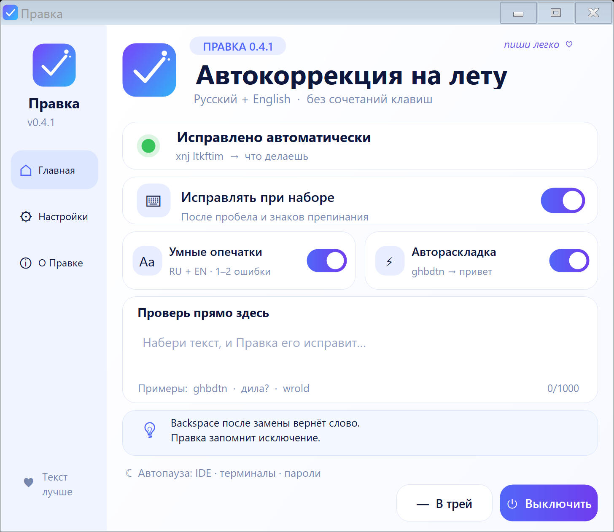

# Правка

Бесплатный локальный автокорректор и переключатель RU/EN для Windows.



`првиет` → `привет` · `wrold` → `world` · `xnj ltkftim` → `что делаешь`

## Скачать

1. Открой **Releases**.
2. Скачай `Pravka-0.4.1-win-x64.zip`.
3. Распакуй весь ZIP и запусти `Pravka.exe`.

Исправления срабатывают после пробела или знака препинания — отдельную комбинацию нажимать не нужно.

## Горячие клавиши (Hotkeys)

- `Пробел` или `.,!?;:…)]}` — проверить только что набранное слово;
- `Backspace` сразу после замены, до начала следующего слова — вернуть исходный вариант и запомнить его как исключение;
- `Alt+Shift`, `Ctrl+Shift` или `Win+Space` — вручную переключить раскладку средствами Windows;
- двойной клик по значку Правки в трее — открыть окно.

Отдельной комбинации для исправления нет: Правка срабатывает сама во время печати. Поставить её на паузу можно главным переключателем или через меню значка в трее.

## Что умеет

- исправляет частые опечатки на русском и английском;
- исправляет неверную раскладку и переключает язык Windows;
- узнаёт 150 000 русских словоформ и не портит редкие правильные слова;
- Backspace сразу после замены возвращает исходное слово и запоминает его;
- работает локально: без аккаунта, сети, истории ввода и телеметрии;
- пропускает IDE, терминалы и поля паролей.

Работает в Блокноте, обычных полях браузеров и многих редакторах/мессенджерах через Windows Accessibility. Нестандартное поле может не поддерживаться — укажи программу в Issue.

## Проверка и сборка

Для сборки исходников нужны Windows x64 и системный .NET Framework 4.x. Интернет и NuGet не требуются.

```powershell
.\build.ps1
.\test.ps1
.\quality-test.ps1
.\integration-test.ps1
.\package.ps1
```

Стресс-тест проверяет 6 000 вариантов опечаток и правильных слов. Подробности — в [`docs/TESTING.md`](docs/TESTING.md).

Код — [MIT](LICENSE). Словарные данные — CC BY-SA 4.0; атрибуция и способ подготовки набора описаны в [THIRD_PARTY_NOTICES.md](THIRD_PARTY_NOTICES.md).
