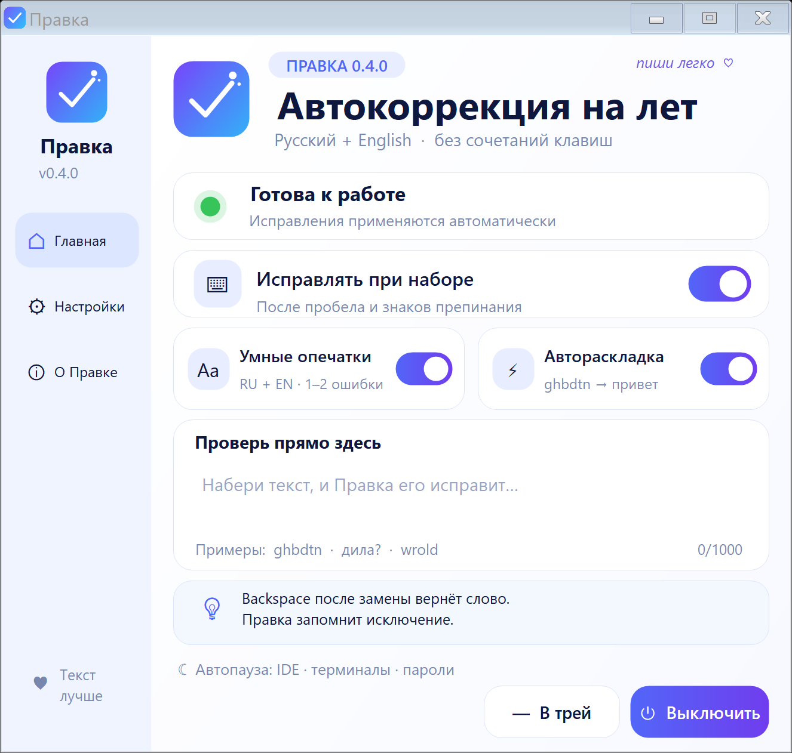

# Правка

Автокорректор для Windows: печатаешь как обычно, Правка чинит явные опечатки после пробела или знака препинания.



`првиет` → `привет` · `wrold` → `world` · `xnj ltkftim` → `что делаешь`

## Что внутри

- русский + английский;
- поиск одной или двух ошибок, включая перестановки и соседние клавиши;
- исправление неверной раскладки и автоматическое переключение языка Windows;
- исправление `ПРивет` → `Привет`;
- работает без горячих клавиш;
- Backspace сразу после замены возвращает слово и навсегда добавляет его в исключения;
- всё локально: нет аккаунта, сети, телеметрии и истории ввода;
- код, терминалы и поля пароля автоматически пропускаются.

## Установка

1. Скачай `Pravka-0.4.0-win-x64.zip` в **Releases**.
2. Распакуй весь ZIP.
3. Запусти `Pravka.exe`.
4. Напечатай в обычном поле: `првиет `.

Windows может показать предупреждение для неподписанного EXE — у проекта пока нет платного сертификата.

## Где работает

Правка подключается к обычным полям ввода через Windows Accessibility. Подходят Блокнот, веб-формы браузера и многие редакторы/мессенджеры. В отдельных нестандартных полях приложение может не сработать — приложи название программы к Issue.

Правка исправляет слова во время набора. Грамматику всей фразы и уже вставленный текст она пока не анализирует.

## Управление

- **Крестик** — свернуть в трей.
- **Пауза** — главный переключатель в окне или меню значка у часов.
- **Выход** — кнопка «Выключить».
- **Автозапуск без окна** — параметр `--background`.

## Сборка

Нужны Windows x64 и системный .NET Framework 4.x. NuGet и интернет не требуются.

```powershell
.\build.ps1
.\test.ps1
.\integration-test.ps1
.\package.ps1
```

Готовый архив появится в `dist/`. Подробная ручная проверка — в [`docs/TESTING.md`](docs/TESTING.md).

## Лицензии

Код — [MIT](LICENSE). Словари — CC BY-SA 4.0; источники указаны в [THIRD_PARTY_NOTICES.md](THIRD_PARTY_NOTICES.md).
